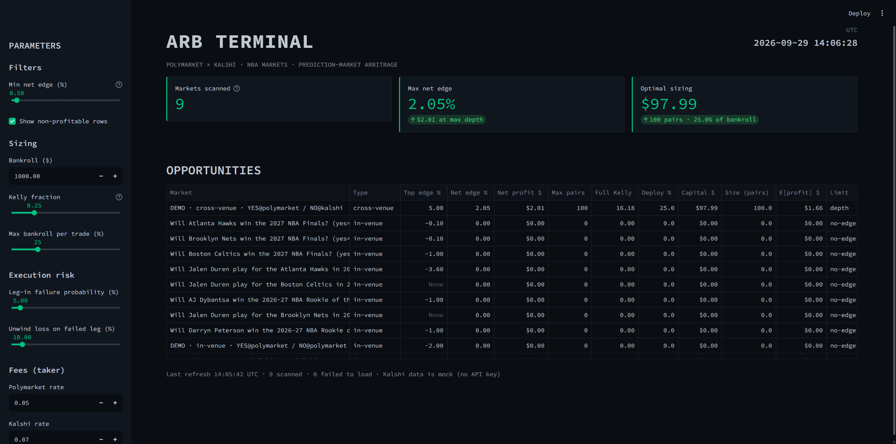

# ARB Terminal

**A Python-based quantitative arbitrage engine for prediction markets.** It ingests live order book data from [Polymarket](https://polymarket.com) and [Kalshi](https://kalshi.com), detects in-venue and cross-venue mispricing on NBA event markets, and sizes positions using a fractional-Kelly model that accounts for execution risk — surfaced through a real-time Streamlit dashboard.



## Features

**Real-time order book traversal.** Rather than comparing only top-of-book prices, the engine walks each side's ask ladder level by level, accumulating fillable size until the marginal unit stops being profitable. This yields an actual tradeable quantity and cost, not just a theoretical spread.

**Dynamic fee-adjusted edge math.** Gross edge (`1 − (YES ask + NO ask)`) is only the starting signal. Every fill is priced against venue-specific taker fee curves — Polymarket's `rate × p × (1 − p)` and Kalshi's cent-rounded equivalent — so reported profit is net, not gross.

**Fractional Kelly position sizing with execution risk modeling.** Positions aren't sized off raw edge alone. A two-leg execution model treats a failed second leg as a distinct loss outcome (the unhedged first leg gets unwound at a cost), derives the Kelly-optimal bankroll fraction `f* = (1 − q)/L − q/b` from that, and applies a fractional-Kelly multiplier plus a hard bankroll cap on top.

## Tech Stack

| Layer | Technology |
|---|---|
| Language | Python 3.13 |
| Data ingestion | Polymarket Gamma & CLOB APIs, Kalshi REST API (`requests`) |
| Arbitrage / sizing engine | Pure Python (`dataclasses`) |
| Dashboard | [Streamlit](https://streamlit.io) |
| Data handling | `pandas` |

## Getting Started

```bash
pip install -r requirements.txt
streamlit run app.py
```

The dashboard opens at `http://localhost:8501`.

---

**Status note:** Kalshi order book data is currently sourced from a local mock JSON file rather than the live authenticated API, so cross-venue rows in the dashboard are labeled `DEMO`. Live Polymarket NBA market data is pulled in real time; in-venue checks on those markets are live.
